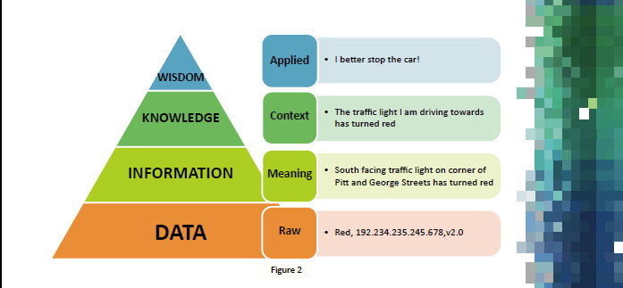
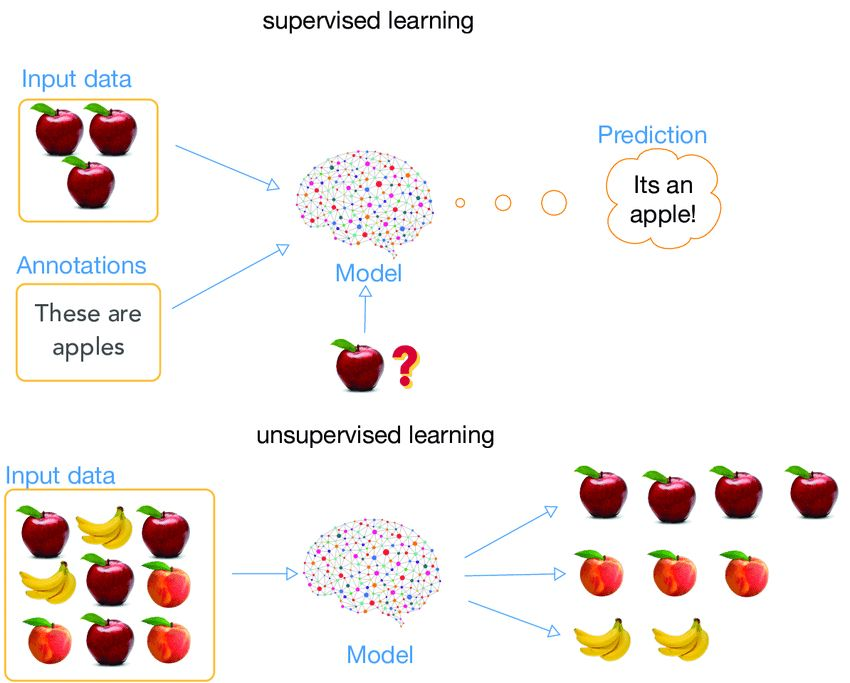
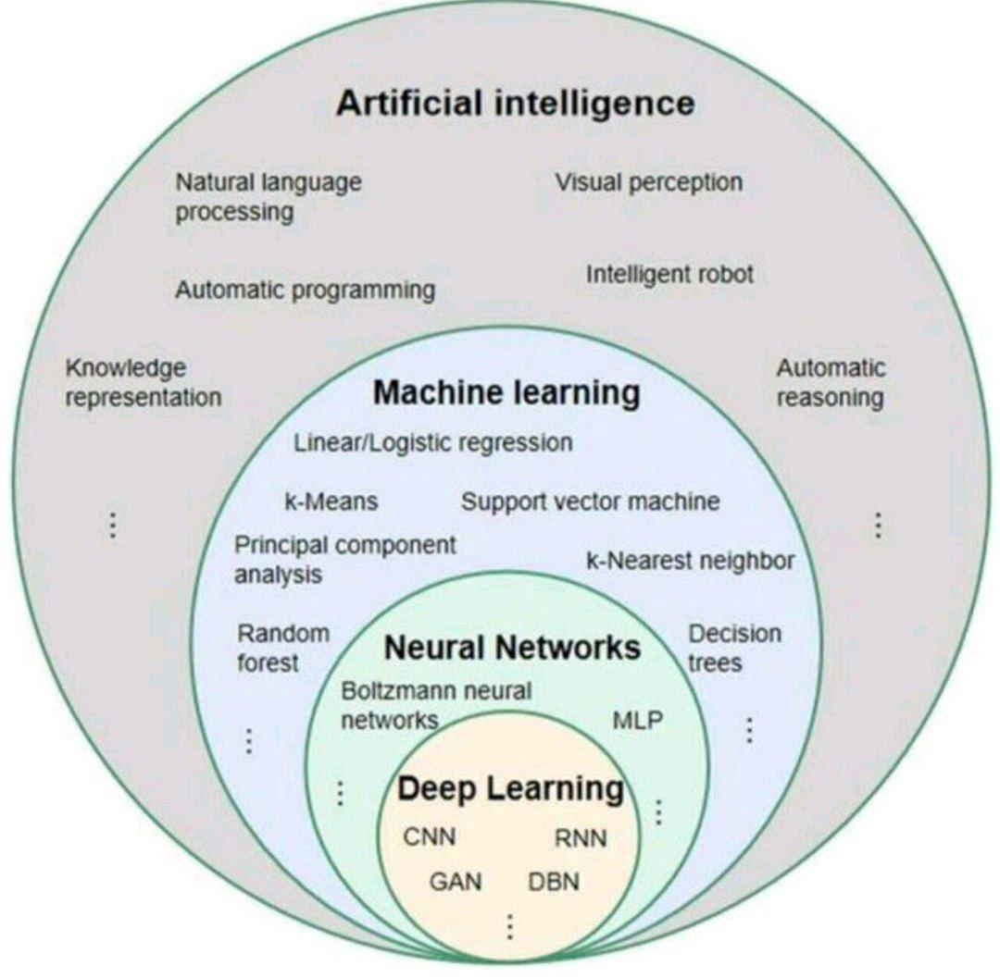
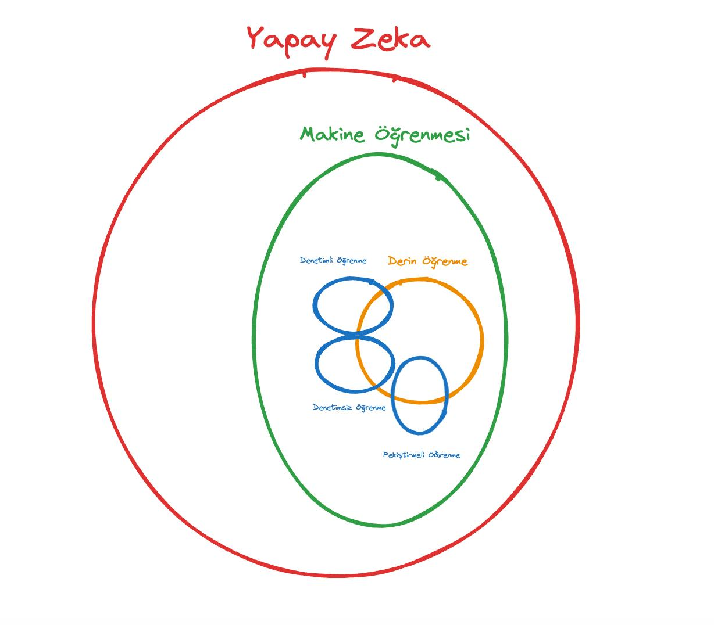

# Unicef & Habitat Derneği Yapay Zeka Eğitmen Eğitimi

  
  

  Author:
    <a href="https://linktr.ee/muffafa" target="_blank">Muhammed Mustafa (muffafa) Savar</a> 
    <small> Kasım 2024</small>
  

  

---

*Habitat Derneği ve UNICEF ortaklığında düzenlenen "Youth Engagement Summit (YES)" etkinliğine katıldım. Bu etkinlik boyunca "Geleceği Eşitle" projesi kapsamında 🤖 Yapay Zeka Eğitmen Eğitimi'nde bireysel olarak aldığım notları sizinle paylaşmak istedim.*

**Eğitimde ele aldığımız konular:**

- 🔹 Yapay zeka nedir ve günümüzdeki yeri
- 🔹 Bilgisayarlar dünyayı nasıl algılar
- 🔹 Üretken yapay zeka araçları
- 🔹 Yapay zekanın alt başlıkları
- 🔹 Bulut ve IoT içinde yapay zeka - Robotik uygulamaları
- 🔹 Yapay zekanın kullanım alanları

Eğitim tarihleri 31.10.2024 - 01.11.2024

---

## Gün 1

### Ders 1 (Açılış & Yapay Zeka nedir? &  Dönüm Noktalan)

- Yapay Zeka Nedir? (Menti)
- Yapay Zeka Tarihi
  - Turing Testi - 1950
    - <https://app.humanornot.ai/>
  - Dartmouth Konferansı - 1956
  - Flim (Ex machine)
  - Chinese room
  - Bilgi, Bilgelik farkı
    - 
  - Garry Kasparov vs Deep Blue
  - AlphaGo vs Lee Sedol (Deep Mind- Mustafa Suleyman)
  - AlphaFold

### Ders 2 (Yapay Zeka Nasıl Çalışır?)

- Yapay Zeka Nasıl Çalışır?
  - Yapay Sinir Ağı
  - Bias
  - Perceptron
  - Aktivasyon Fonnksiyonları
    - Relu
    - Sigmoid
  - Goffrey Hinton (Gradient Decent)
  - Back Propagation
  - Yuval Noah Harari (Neksus)
  - Çok Katmanlı Yapay Sinir Ağları
    - Hiden Layer
  - Yapay Zekanın Temel Çalışma Prensipleri
    - Algoritma
    - Veri
    - Öğrenme Yöntemleri
      - 
      - Denetimli (Supervised)
      - Denetimsiz (Unsupervised)
      - Pekiştirmeli (Rainforcement)

### Ders 3 (Yapay Zekanın Toplum Üzerindeki Dönüştürücü Etkisi)

- Yapay Zekanın Toplum Üzerindeki Dönüştürücü etkisi
  - <https://www.mindmeister.com/>
    - 

  - Veri Gizliliği ve Etik Sorunlar
    - Cambridge Analytica
    - Amazon'un İşe Alım Algoritması
    - Apple Card Cinsiyet Ayrımclığı İddiası
  - Gençler Üzerinde Yapay Zekanın Etkisi

### Ders 4 (Yapay Zekanın Toplum Üzerindeki Etkileri Uygulama Seansı)

- Google Slide Atölyesi (Eğtim ve Sağlık Sektörlerinde Yapay Zekanın Pozitif ve Negatif Etkileri)

### Ders 5 (Bilgisayarların Dünyayı Algılaması)

- Bilgisayarların dünyayı algılaması
  - Sensörler
  - Vector Uzayı
  - Teachable machine
    - <https://teachablemachine.withgoogle.com/>
    - <https://ide.mblock.cc/>
    - AlphaProof ve AlphaGeometry

---

## Gün 2

### Ders 6 (Üretken Yapay Zeka)

- Temel Yapay Zeka Kavramları
  - Dünkü dersin grafiği:
    - 
    - 
  - Makine Öğrenmesi
  - Derin Öğrenme
  - Büyük Dil Modelleri
  - Prompt
  - Doğal Dil İşleme
  - Veri Seti
  - Sürümleme ve Eğitim (Fine-Tuning)
- <https://evrimagaci.org/insan-gozu-kac-megapikseldir-1373>
- Pass the Ball Videosu
- Yapay Zekanın Kullanım Alanları (Mindmap)
  - 
- Cognative Load Theory
- Bager Akbat ve Robot Şair Deniz Yılmaz

### Ders 7 (Büyük Dil Modelleri BDL'ler)

- Uygulama Etkinliği
- Refik Anadol
- Büyük Dil Modelli
  - ChatGPT
  - Gemini
  - Llama
  - Copilot
  - Claude
- Uygulama prompt
  - "Bir adam nehrin karşısına geçerken yanında bir koyun bir de kurt var. Her seferinde tek bir hayvanı nehrin karşısına geçirebilir. Bunun için adımları  bana yazabilirmisin?"
- Magic School
  - <https://www.aixploria.com/en/ultimate-list-ai/>

### Ders 8 (Büyük Dil Modelleri)

- Veri analizi için vaka çalışması
- Prompt Nedir?
- Prompt Yazma Teknikleri
  - Çok adımlı sorular
  - Detaylı sorular
  - Örnek ve karşılaştırma istemek
  - Yaratıcı Sorular

### Ders 9 (Görsel Üretimi ve İstem Geliştirme Teknikleri)

- Metin Üretme
- Yazı Tammamlama (GPT Open AI)
- Resim üretme
  - GANN

### Ders 10 (Görsel Üretimi Uygulama Seansı)

- Copilot
- stable difisson online
- leanordo.ai
- <https://blackforestlabs.ai/>

---

## Gün 3

### Ders 11 (IoT Cihazlar ve Veri Toplama)

### Ders 12 (Veri Analizi)

### Ders 13 (Üretken Medya Araçları)

### Ders 14 (Canva'nın AI ile Güçlendirilmiş Uygulamarı)

### Ders 15 (Yapay Zeka'nın Geleceğe Etkisi Uygulama Seansı)

## Ekstra Notlar

- <https://monica.im/>
